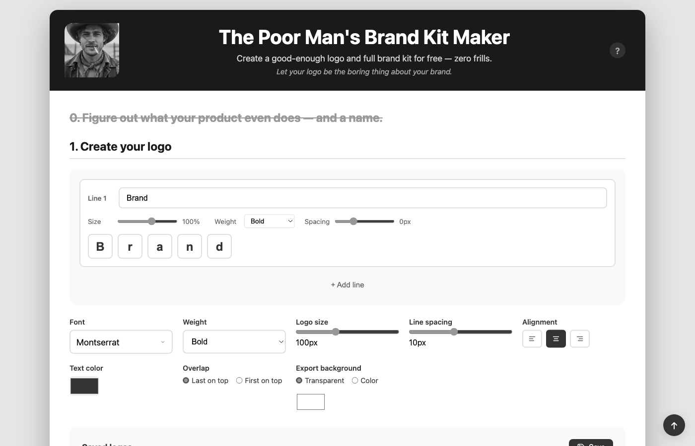

# Poor Man's Brand Kit

You don't have product-market fit. You don't have validation. 
And you probably don't have money.
Yet you're supposed to burn money on a logo?

Nope. Build your "good enough" brand kit in 30 seconds. Free.

**[Use it now](https://davstr1.github.io/poormanbrandkit/)** — Free. No signup. No shenanigans.

## What you get

One ZIP file with:
- Your logo in all sizes (PNG + vector SVG)
- Favicons ready to drop in your HTML
- iOS icons for the App Store
- Android icons for the Play Store
- The font file so you can use it anywhere

No watermarks. No "upgrade to pro". Just your stuff.

## Features

- Multi-line text logos (up to 3 lines)
- Per-letter color customization
- 100+ Google Fonts with live preview
- Real-time SVG preview (WYSIWYG)
- Save/load configurations locally
- Works offline (after first load)

## Why this thing?

I needed a logo and a couple of icons — fast.

Every "brand kit generator" I found was a paid clicko-machine pretending to be a creative oracle. I didn't want that. I want my things to be personal.

And I have far more important tasks to focus on at this stage.

So I built my own tool. And since it costs nothing to share, here it is.

This is for my people grinding at night, with zero budget and oversized dreams.

## Usage

1. Open the [live app](https://davstr1.github.io/poormanbrandkit/) or `index.html` locally
2. Type your brand name
3. Click letters to change their color
4. Pick a font
5. Click "Generate Brand Kit"
6. Get a ZIP with all your assets

That's it.

## Tech Stack

- Vanilla JS (no framework)
- Canvas API for PNG rendering
- opentype.js for SVG generation
- JSZip for export
- Google Fonts API

Zero build step. Zero dependencies to install. Just HTML/CSS/JS.

## Contributing

1. Fork
2. Make your changes
3. PR with clear description
4. No mega-PRs that "refactor everything"

## License

Free like a beer someone sends you from the other side of the bar.

MIT License — do whatever you want.

---

Built with Claude Code, grit, and zero budget.

*Now go build something.*
